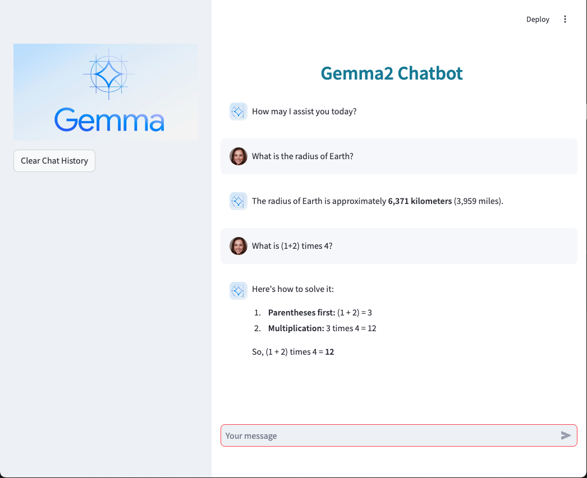

# Chatbot using a Kaggle Model

## Introduction

This small project demonstrates how to build a Chatbot using a Kaggle Models.
The model used in Gemma 2 (gemma-2-2b-it-v2).


## Model

You will have to download and unzip first the model fromn Kaggle. The model is stored in `gemma-2-transformers-gemma-2-2b-it-v2` folder.
Alternatively, you can run a short Python script to download the model from your local:

```
import kagglehub

# Download latest version
path = kagglehub.model_download("google/gemma-2/transformers/gemma-2-2b-it")

print("Path to model files:", path)

```

When using `kagglehub`, you will also have to set the Kaggle environment variables.

```
load_dotenv()
os.environ["KAGGLE_USERNAME"] = os.getenv("kaggle_username")
os.environ["KAGGLE_KEY"] = os.getenv("kaggle_key")
```

## Backend

The backend uses a `ModelInterface` class and a `FastAPI` service.

The `ModelInterface` class initialize the model, loads the tokenizer and the model. 
It also implements a query function, `get_message_response`.

In the `FastAPI` application, the endpoint that receive requests from the frontend, upon user querying the chatbot, is `/chat_messages/` `[POST]`.

To start the backend, run:

```
uvicorn main:app --reload
```

## Frontend

The frontend is implemented using `streamlit`. When user enters a query, the endpoint from main app is accessed.

To start the frontend, run:

```
streamlit run app.py
```

See below an example of usage of the chatbot.

